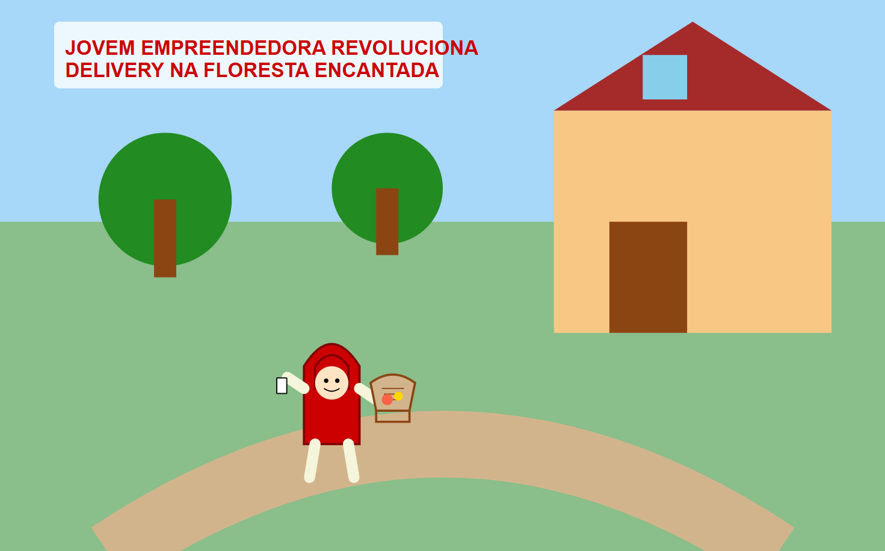
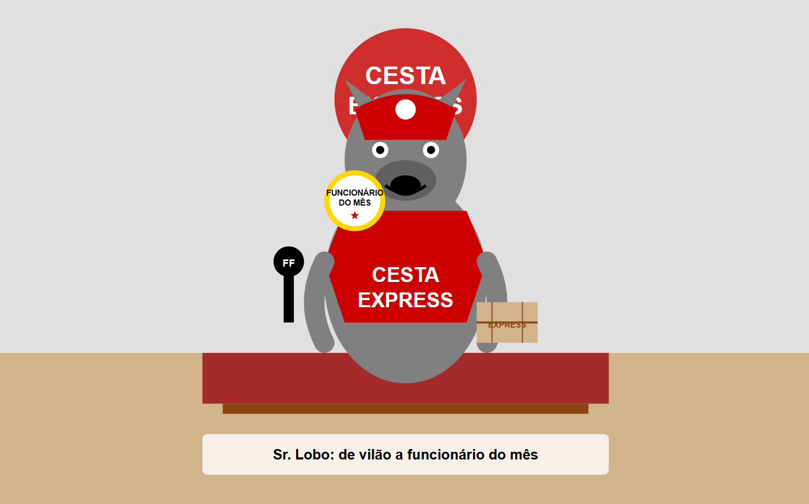
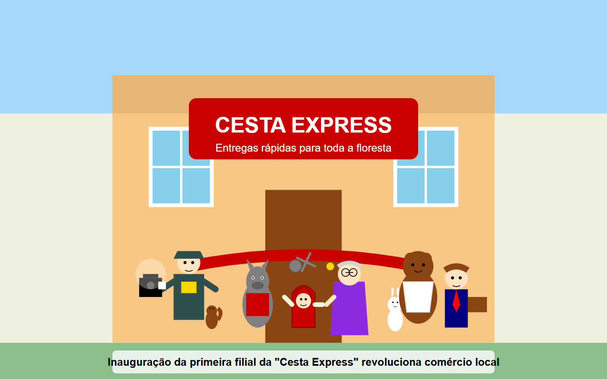

# FOLHA DA FLORESTA
## Edição Especial | Domingo, 4 de maio de 2025

# JOVEM EMPREENDEDORA TRANSFORMA CRISE EM OPORTUNIDADE DE NEGÓCIO
## Chapeuzinho Vermelho inaugura rede de delivery que revoluciona o comércio na floresta
### Por: Repórter Grilo Falante

**FLORESTA ENCANTADA** - O que começou como uma simples visita à avó doente se transformou em um caso de sucesso empresarial que está mudando a economia local. A jovem Maria Silva, mais conhecida como "Chapeuzinho Vermelho" devido ao seu característico capuz escarlate, inaugurou ontem a primeira filial de sua rede de entregas "Cesta Express", um serviço de delivery que promete revolucionar o comércio na região da Floresta Encantada.

Tudo começou há três meses, quando a jovem de 18 anos foi incumbida pela mãe de atravessar a floresta para levar mantimentos à sua avó enferma. "Era um trajeto perigoso, onde eu sempre encontrava criaturas estranhas pelo caminho", conta Maria em entrevista exclusiva.

Foi durante uma dessas entregas que ocorreu o incidente que mudaria sua vida. "Encontrei um lobo que tentou me enganar para chegar antes à casa da minha avó", relembra a empresária iniciante. "Mas eu estava preparada. Minha mãe sempre me alertou sobre os perigos da floresta."

O lobo em questão, Sr. Lobo Cinzento, que concordou em ser entrevistado para esta reportagem após assinar um acordo jurídico, admite que suas intenções não eram as melhores. "Eu estava com fome e vi uma oportunidade", confessa, visivelmente constrangido. "Mas a menina era mais esperta do que imaginei."

Ao perceber que estava sendo enganada, Chapeuzinho usou o aplicativo de localização em tempo real que havia desenvolvido como projeto escolar e alertou o serviço de guarda florestal. O caçador Joaquim Machado, que patrulhava a área, interceptou o lobo antes que ele pudesse entrar na casa da Sra. Silva, avó da jovem.

"Quando cheguei ao local, o lobo estava prestes a invadir a residência. Foi por pouco", conta o caçador Machado, que hoje trabalha como chefe de segurança da "Cesta Express".

## DE VILÃO A FUNCIONÁRIO DO MÊS

O desfecho da história, no entanto, é o que mais surpreende. Em vez de punir o lobo, Chapeuzinho propôs um acordo: ele trabalharia em sua recém-criada empresa de entregas, utilizando seu conhecimento dos caminhos da floresta e sua velocidade natural para otimizar as rotas de entrega.

"Vi uma oportunidade de negócio ali", explica a jovem empreendedora. "Muitos moradores da floresta têm dificuldade em se deslocar para fazer compras, especialmente os mais idosos. Por que não criar um serviço que resolvesse esse problema?"

A "Cesta Express" começou modestamente, com entregas apenas para a avó de Chapeuzinho, mas rapidamente se expandiu. Hoje, apenas três meses após o incidente, conta com uma frota de 15 entregadores, incluindo o próprio Sr. Cinzento, que, surpreendentemente, foi eleito funcionário do mês em abril.

"Ele conhece todos os atalhos e consegue fazer entregas em tempo recorde", justifica Chapeuzinho. "As pessoas ficam um pouco assustadas na primeira vez que ele toca a campainha, mas logo se acostumam."

## IMPACTO ECONÔMICO

A iniciativa está transformando a economia local. Pequenos produtores que antes tinham dificuldade em escoar sua produção agora utilizam o serviço para entregar seus produtos frescos diretamente aos consumidores.

"Minhas vendas de bolos e tortas triplicaram desde que comecei a trabalhar com a Cesta Express", afirma Dona Ursa, confeiteira tradicional da região. "Agora posso me concentrar no que faço de melhor, sem me preocupar com as entregas."

A avó de Chapeuzinho, que inicialmente era apenas uma cliente, hoje é a diretora financeira da empresa. "Minha neta transformou um susto em um negócio próspero. Estou muito orgulhosa", declara a Sra. Silva, que já está completamente recuperada de sua enfermidade.

O projeto chamou a atenção de investidores. Na última semana, a startup recebeu um aporte de 2 milhões de moedas de ouro do Fundo de Investimentos "Contos de Fadas Tech Ventures", o que permitirá a expansão para outras florestas.

"Estamos impressionados com o modelo de negócio e, principalmente, com a capacidade da jovem empreendedora de transformar adversidades em oportunidades", comenta João Pé de Feijão, diretor do fundo de investimentos.

## PROJETOS FUTUROS

Chapeuzinho já planeja os próximos passos. "Estamos desenvolvendo um aplicativo que permitirá aos clientes acompanhar suas entregas em tempo real e avaliar o serviço dos entregadores", revela. "Também estamos trabalhando em um programa de fidelidade chamado 'Cesta Cheia', onde os clientes ganham pontos a cada pedido."

O Sr. Cinzento também tem seus próprios projetos. "Estou economizando para abrir uma franquia da Cesta Express na Floresta do Norte. Nunca pensei que pudesse mudar de vida desta forma", confessa o ex-vilão da história, que agora cursa Administração de Empresas à distância.

A história de Chapeuzinho Vermelho e sua empresa inovadora prova que, com criatividade e resiliência, é possível transformar até mesmo os encontros mais assustadores em oportunidades de ouro. Uma verdadeira lição de empreendedorismo que está reescrevendo o final desta clássica história.

---

**Prompts utilizados para a criação desta notícia:**
1. Prompt para o texto principal: "Criar uma versão jornalística da história 'Chapeuzinho Vermelho' onde a protagonista transforma o encontro com o lobo em uma oportunidade de negócio, criando um serviço de delivery na floresta. Incluir detalhes sobre como o negócio funciona, a reação da comunidade e como o lobo se tornou funcionário da empresa."
2. Prompt para a primeira imagem: "Criar uma imagem estilo ilustração de jornal mostrando Chapeuzinho Vermelho moderna chegando à casa da avó com uma cesta de entregas, vestindo seu capuz vermelho tradicional mas com elementos modernos como um tablet ou smartphone."
3. Prompt para a segunda imagem: "Criar uma imagem estilo ilustração jornalística mostrando o Lobo da história de Chapeuzinho Vermelho vestido com uniforme de entregador, segurando um pacote e sorrindo para a câmera durante uma entrevista."
4. Prompt para a terceira imagem: "Criar uma imagem estilo fotojornalismo mostrando a inauguração de uma pequena loja com placa 'Cesta Express', com Chapeuzinho Vermelho cortando uma fita vermelha, rodeada por sua avó, o lobo em uniforme e outros personagens da floresta como clientes e funcionários."